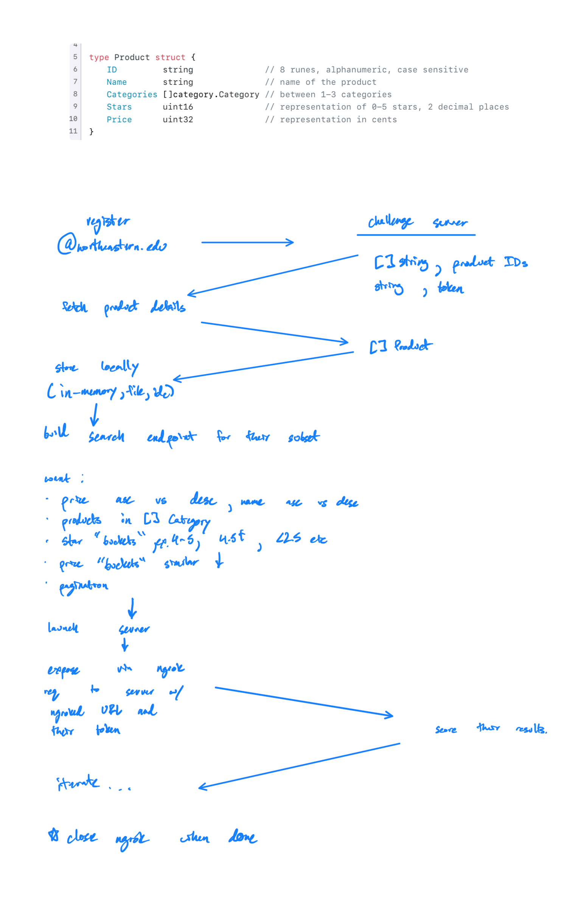

# prods
production-grade products

## Frontend
A challenge to test applicants' abilities to:
- Consume & comprehend API documentation
- Implement a design from Figma
- Identify patterns for reusable components
- Data fetching & error handling

## Backend
A challenge to test applicants' abilities to:
- Consume & comprehend API documentation
- Read documentation for potentially new tools (ngrok)
- Write a simple API
- Consider errors vs good defaults

Based on the following diagram:

